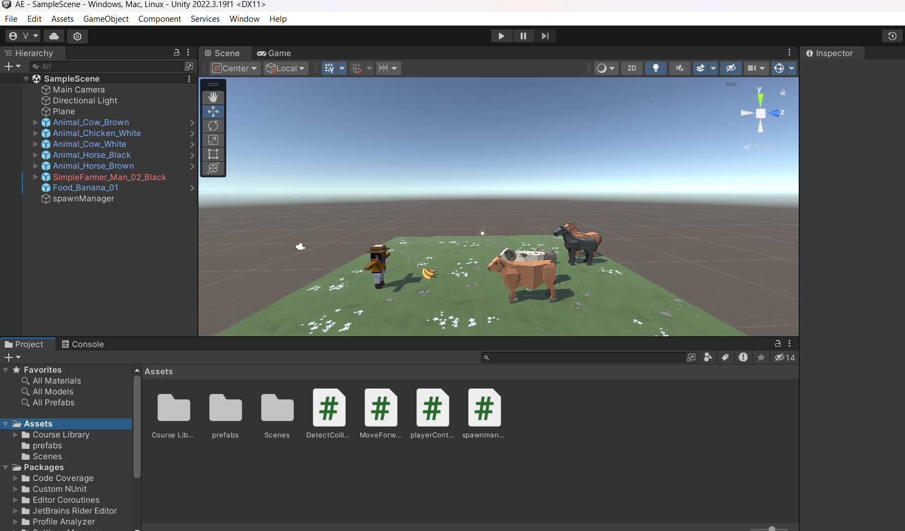

# Ex4.1-Animal-Feeding-Phase1
## Aim:
To develop a animal feeding game-Phase-1 using unity.

## Algorithm:
## Player Controller:
Step 1: Extract the package and in unity , asserts -> Import packages -> Custom packages and select the package. When we go to Assets folders we can see the course library which we extracted

Step 2: If you want, drag a different material from Course Library > Materials onto the Ground object

Step 3: Drag 1 Human, 3 Animals, and 1 Food object into the Hierarchy

Step 4: Rename the character “Player”, then reposition the animals and food so you can see them

Step 5: Adjust the XYZ scale of the food (2,2,2) so you can easily see it from above

Step 6: In your Assets folder, create a “Scripts” folder, and a “PlayerController” script inside.Attach the script to the Player by dragging the c# file to the player and open in the inspector and check whether it is attached

## Moving Controller:
Step 1: Create a new “MoveForward” script, attach script to the Food Pizza by dragging the c# file to the pizza and open in the inspector and check whether it is attached

Step 2: Create a new “Prefabs” folder, drag your food (Pizza) into Prefab folder, and a pop up raises-> choose Original Prefab

Step 3: Select the Player in the hierarchy, then drag the pizza from your Prefabs folder onto the new Projectile Prefab box in the inspector

Step 4: Rotate all animals on the Y axis by 180 degrees to face down

Step 5: Select all three animals in the hierarchy and Add Component > Drag the Move Forward script from the Scripts into inspector

Step 6: Edit their speed values and test to see how it looks. Drag all three animals into the Prefabs folder, choosing “Original Prefab”

## Program:
Name: Vinush.cv

reg no: 212222230176

## Program Controller:
```c#
using System.Collections;
using System.Collections.Generic;
using UnityEngine;

public class PlayerController : MonoBehaviour
{
    // Start is called before the first frame update
    public float horizontalInput;
    public float speed = 10.0f;
    public float xRange = 10f;
    public GameObject projectilePrefab;
    void Start()
    {
        
    }

    // Update is called once per frame
    void Update()
    {
        if(transform.position.x < -xRange)
        {
            transform.position = new Vector3(-xRange, transform.position.y, transform.position.z);
        }
        if(transform.position.x>xRange)
        {
            transform.position = new Vector3(xRange, transform.position.y, transform.position.z);
        }
        horizontalInput = Input.GetAxis("Horizontal");
        transform.Translate(Vector3.right * horizontalInput * Time.deltaTime * speed);
        if(Input.GetKeyDown(KeyCode.Space))
        {
            Instantiate(projectilePrefab,transform.position,projectilePrefab.transform.rotation);
        }
    }
}

## Move Forward:

```c# 
using System.Collections;
using System.Collections.Generic;
using UnityEngine;

public class MoveForward : MonoBehaviour
{
    // Start is called before the first frame update
    public float speed = 40.0f;
    void Start()
    {
        
    }

    // Update is called once per frame
    void Update()
    {
        transform.Translate(Vector3.forward*Time.deltaTime*speed);
    }
}
```

## Output:



## Result:
Animal feeding game-Phase-1 using unity is developed successfully.

